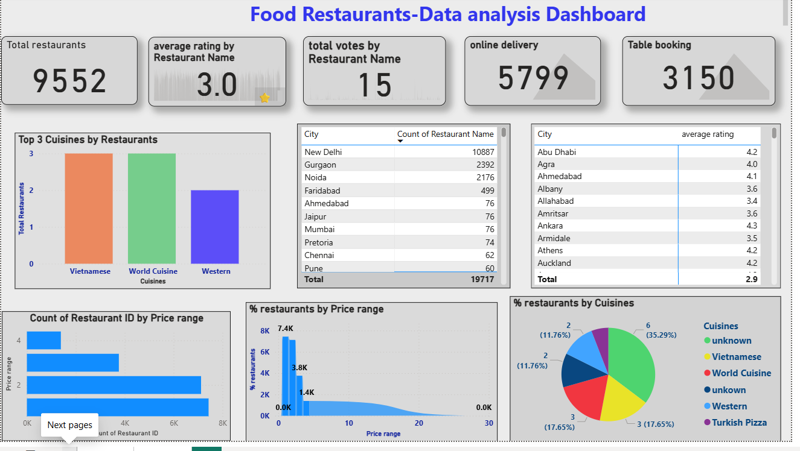
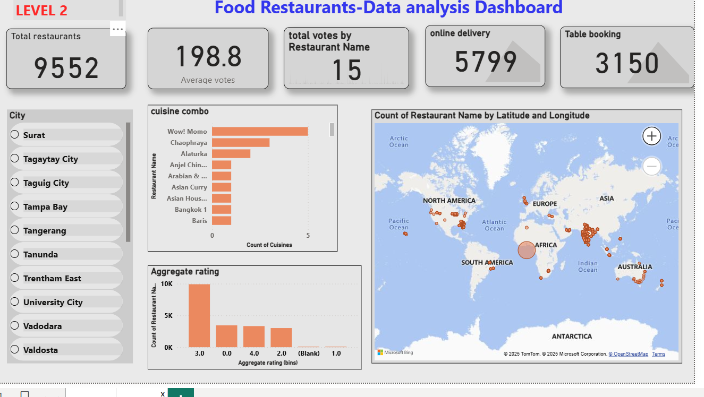

# cognifyz_Internship
# 🍽 Restaurant Data Analysis Dashboard

This project explores a restaurant dataset to uncover key insights using *Power BI* and *Python (Jupyter Notebook)*. It includes two levels of dashboards and visual analytics designed for business intelligence and decision-making.

## 📁 Project Overview

- *Level 1 (Power BI):*
  - Total Restaurants
  - Average Rating
  - Online Delivery & Table Booking %
  - Top Cuisines & Cities
  - Price Range Distribution

- *Level 2 (Power BI + Python):*
  - Cuisine Combinations
  - Geographic Analysis with Map
  - Ratings Distribution (binned)
 

## 🧪 Tools Used

- *Power BI* – For interactive dashboards and data storytelling
- *Jupyter Notebook (Python)* – For data preprocessing and geospatial mapping
- *Libraries* – pandas, matplotlib, seaborn, folium

## 📊 Visuals Preview

### Level 1 Dashboard  

### Level 2 Dashboard  

## 📌 Key Insights

- The most common rating range is *3.0 – 3.5*
- Majority of restaurants do not offer *online delivery*
- *North Indian* and *Chinese* cuisines dominate the food market
- Cities like *New Delhi* and *Gurgaon* host the most restaurants
- Restaurant chains like *Wow! Momo* have widespread presence
